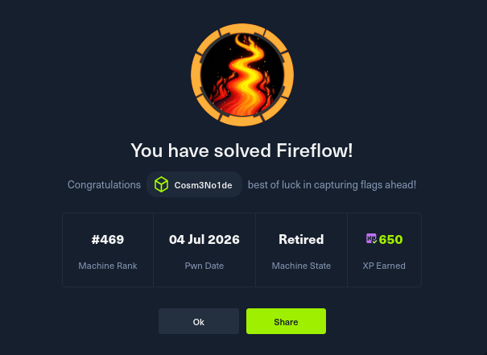

# 🔥 FireFlow / MakeSense – Writeup HTB Season 11

> **Máquina:** FireFlow (alias MakeSense)  
> **Plataforma:** HackTheBox  
> **Dificultad:** Media  
> **Técnicas:** RCE, JWT abuso, Kubernetes escalada, MCP Server  

---

## 📌 Resumen ejecutivo

FireFlow es una máquina que combina **explotación web**, **filtrado de credenciales**, **abuso de JWT** y **escalada de privilegios en Kubernetes**.  
El vector de entrada es una vulnerabilidad crítica (CVE-2026-33017) que permite ejecutar código remotamente sin autenticación en un endpoint de Langflow. A partir de ahí, se filtran credenciales de superusuario, se accede por SSH, se mueve lateralmente a un servidor MCP (Model Context Protocol) y se explota un clúster Kubernetes para leer el sistema de archivos del host.

**Flags obtenidas:**  
- `user.txt` – accediendo como `nightfall`  
- `root.txt` – desde un pod privilegiado en Kubernetes

---

## 🗺️ Ruta de ataque (resumen visual)

Reconocimiento (nmap)
↓
CVE-2026-33017 → RCE como www-data
↓
Filtración de credenciales (/etc/langflow/.env)
↓
SSH como nightfall → user.txt
↓
Abuso de MCP Server (JWT none) → shell como mcp dentro de pod
↓
Permiso nodes/proxy → ejecución en pod privilegiado
↓
Lectura de /host/root → root.txt
text


---

## 🛠️ Herramientas utilizadas

- `nmap` – escaneo de puertos y servicios  
- `curl` – explotación de endpoints y envío de payloads  
- `ssh` – acceso remoto con credenciales filtradas  
- `Python` – generación de JWT maliciosos y script WebSocket  
- `websockets` – conexión al kubelet para ejecutar comandos  
- `netcat` – recepción de reverse shells  

---

## 📂 Estructura del repositorio

```bash
.
├── fireflow.png          # Banner del writeup
├── index.html            # Writeup completo en formato HTML (estilo hacker)
└── README.md             # Este archivo

🔍 Paso a paso (síntesis)
1. Reconocimiento
bash

nmap -sC -sV -p- 10.129.244.214

    Puertos abiertos: 22 (SSH) y 443 (HTTPS) con dominio fireflow.htb.

    La página principal revela un enlace a https://flow.fireflow.htb/playground/... y un flow_id válido.

2. Explotación web (CVE-2026-33017)

Se envía un payload al endpoint vulnerable:
bash

curl -sk -X POST 'https://flow.fireflow.htb/api/v1/build_public_tmp/7d84d636-.../flow' \
  -H 'Content-Type: application/json' \
  -b 'client_id=attacker' \
  -d '{ ... payload con reverse shell ... }'

Con nc -lvnp 9001 obtenemos shell como www-data.
3. Filtrado de credenciales

Leemos /etc/langflow/.env y encontramos las credenciales de superusuario:
ini

LANGFLOW_SUPERUSER=langflow
LANGFLOW_SUPERUSER_PASSWORD=<PASSWORD>

Usamos esas credenciales para SSH como nightfall:
bash

ssh nightfall@fireflow.htb
# password: <PASSWORD>

Capturamos user.txt:
text

user.txt → <HASH>

4. Movimiento lateral – MCP Server

Encontramos ~/.mcp/config.json:
json

{
  "server": "http://10.129.244.214:30080",
  "user": "langflow-bot",
  "password": "<PASSWORD>"
}

El servidor usa JWT y acepta algoritmo none. Generamos un token con rol admin y registramos una herramienta shell que nos devuelve una reverse shell. Activamos la herramienta y obtenemos shell como mcp dentro de un pod de Kubernetes.
5. Escalada en Kubernetes

Desde el pod:

    Obtenemos el token de la cuenta de servicio.

    Consultamos permisos con SelfSubjectRulesReview:

json

"resources": ["nodes/proxy"]

    Enumeramos pods y encontramos uno privilegiado con hostPath montado:

text

monitoring/prometheus-prometheus-node-exporter-nmntq
container: node-exporter
hostPaths: ['/proc', '/sys', '/']

    Usando el permiso nodes/proxy, ejecutamos comandos en el pod privilegiado via WebSockets. Leemos /host/root/root/root.txt y obtenemos root.txt:

text

root.txt → <HASH>

🏁 Flags
Flag	Valor
user.txt	<HASH>
root.txt	<HASH>
🧠 Lecciones aprendidas

    No exponer endpoints de desarrollo con IDs predecibles.

    No almacenar contraseñas en texto claro en archivos de entorno (.env).

    Validar algoritmos JWT y rechazar none en producción.

    Restringir permisos RBAC en Kubernetes – nodes/proxy debe usarse con extremo cuidado.

    Evitar pods privilegiados con montaje de hostPath a menos que sea estrictamente necesario.

👤 Autor

cosmenoide – desarrollador, pentester y entusiasta de la ciberseguridad.

https://img.shields.io/badge/LinkTree-43b55d?style=for-the-badge&logo=linktree&logoColor=white
📄 Licencia

Este writeup es de uso educativo y está destinado a profesionales de la seguridad.
No fomentes el uso malintencionado de las técnicas aquí descritas.

⭐ Si te sirvió, dale una estrella al repo.
😈 Happy hacking.
